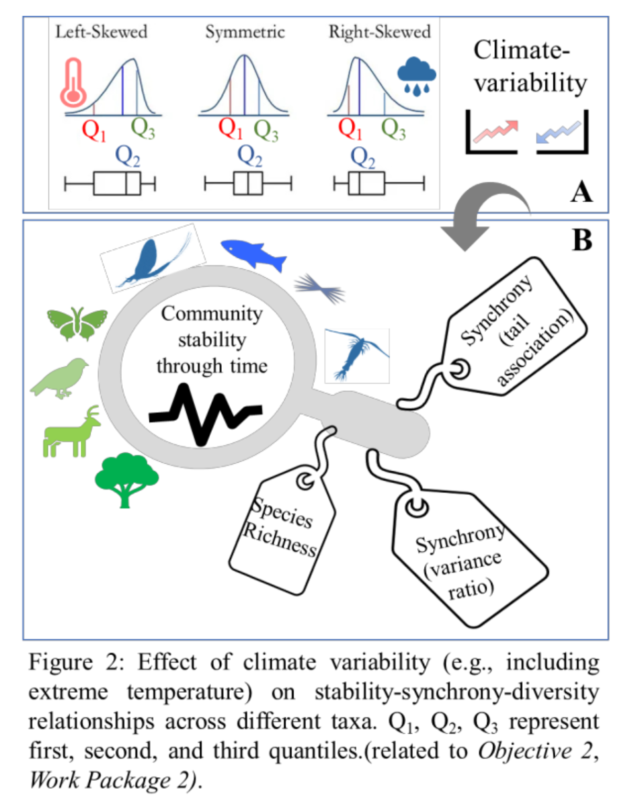

```{r include = FALSE, echo = FALSE}
knitr::opts_chunk$set(include = TRUE,
                      warning = FALSE,
                      message = FALSE,
                      cache = FALSE)
```

```{r echo = FALSE}
rm(list = ls())
library(tidyverse)
library(patchwork)
library(here)
#source(here("r", "various_useful_functions.r"))
source("mtime.R")
```

# Introduction

*The following text originally came from the Ghosh UZH UFO application*

As the global climate is experiencing more heat, and less rainfall - it is reasonable to expect that the distributions of these variables (temperature and rainfall) are becoming more skewed and asymmetric towards the extreme values (see figure \@ref(fig:introduction-figure) below, which comes from the UZH UFO proposal, where it was figure 2). With the availability of more open access long-term databases, it is possible to address how different taxa respond at the community level.

```{r introduction-figure, echo=FALSE, fig.cap="Introduction figure", out.width = '50%', fig.align='center'}

```


As a preliminary work, I have already gathered long-term (median of 41 years) species-level abundance data for 2043 terrestrial and 716 aquatic communities. My recent result (manuscript in preparation) shows that the community stability is different for terrestrial and freshwater taxa and could be better explained considering the different strengths between pairwise species associations at the extremes, called community-level tail association, than with classic correlates of community stability studies (richness and variance ratio).

I will gather global data for annual temperature and rainfall from open access CHELSA database19 and ask how variability in temperature and precipitation would affect terrestrial taxa (birds, mammals, invertebrates, plants). For freshwater taxa (fish, phytoplankton, invertebrates), mostly temperature variability would be considered. In marine realm, sampling is spatially not consistent over the years20 and also very few long-term (>20yrs) data sampled compared to terrestrial and freshwater, thus I will focus only on the latter two realms. Also, species-level biomass (or body size) data will be gathered considering different generation times across taxa.

I will focus on community stability and will build a Bayesian model incorporating climatic factors (e.g., variability, skewness, range of maximum and minimum of temperature-distribution over the years etc.). While scientists studied thermophilization in the context of warming-related turnover in communities, no predictive model for community stability has been developed, to date, assessing the effect of extreme climatic events across taxa using a global database. This study will inform the current status of communities across multiple taxa facing climatic extremes and help prioritize conservation efforts (see Work Package 2).

I will gather annual climate data (mean, minimum, maximum for temperature, rainfall) and compute the variability, and the skewness of their distribution for the study period over which the community dynamics was studied. I will compute the richness (number of total species and dominant species that were present minimum 70% of the total years sampled), variance ratio, community level total tail association from pairwise synchrony as drivers. These drivers appeared as significant for explaining variation in community stability from my recent study (manuscript in preparation). I will compute the response variable community stability as the inverse of community-variability over the study period. Then, I will build a Bayesian model to see the effect of climate parameters, on the stability-driver relationships for different taxa.

# Data

## Data structure
Total 1948 community timeseries we have collected for the timespan 1979-2019. 4 taxa are considered - birds, fish, freshwater invertebrates, terrestrial invertebrates. Below is the summary of the datatable. Description of each column is given in [README.txt](https://github.com/sghosh89/WP2/tree/main/Results)
```{r read_data_str, echo=F}
library(dplyr)
library(tidyverse)

sm_all<-read.csv("../Results/stability_metric_and_env_all.csv")
str(sm_all) # total communities within 1979-2019 timespan, we selected only 4 taxa
```

But see the below table which shows the sample size for each taxa and the datasource, we have very few sample size for terrestrial invertebrates. **I feel** it's better to write a paper about north american birds vs european fish (atleast we have >500 datapoints for birds and fish). But I am open to other ideas. I don't know which kind of data requirement we need for response diversity, but if we can have the body size or biomass (as trait) data then I can test the H0: whether response diversity increases the stability or influenced by temperature?
```{r read_data_str2, echo=F}
sm_all%>%group_by(TAXA,source)%>%summarise(n=n())%>%ungroup()
```

## Sitemap for each taxa

```{r sitemap_figure, echo=FALSE, out.width = '100%', fig.align='center'}
library(htmltools) 
library(htmlwidgets)
library(leaflet) 

taxalist<-c("birds","fish","freshwater invertebrates","terrestrial invertebrates")
sitemaplist<-vector(mode = "list", length = length(taxalist))
#op<-par(mfrow=c(2,2))
for(i in 1:length(taxalist)){
  taxa<-taxalist[i]
  dat<-sm_all%>%filter(TAXA==taxa)%>%dplyr::select(STUDY_ID,newsite,LATITUDE,LONGITUDE)
  
  sitemap<-leaflet(dat) %>% addTiles() %>%
    addMarkers(~LONGITUDE, ~LATITUDE, label = ~htmlEscape(newsite))%>%
    addControl(paste(taxa,", n = ",nrow(dat),sep=""), position = "bottomleft", className="map-title")
  sitemaplist[[i]]<-sitemap
  f<-paste("../Results/res_Prelim_Report/samplingsite_",taxa,
           ".html",sep="")
  htmlwidgets::saveWidget(sitemap, 
                          file.path(normalizePath(dirname(f)),basename(f)))
}
#par(op)
#htmltools::includeHTML("../Results/res_Prelim_Report/samplingsite_birds.html")
sitemaplist[[1]]
sitemaplist[[2]]
sitemaplist[[3]]
sitemaplist[[4]]
```

# Methods

# Results

I want to see how community stability-drivers relationship would affect by the changing environmental variable (annual temperature distribution). Temperature could vary in many ways (see \@ref(fig:drawing-figure)). I am considering three aspects of environmental (temperature) timeseries here: median of annual temperatures ($t_{med}$) during the study periods, trend ($t_{trend}$) and skewness ($t_{skw}$) of annual temperature timeseries for a given community. 
My intuition is:

  - community stability would be affected by any of these temperature component either directly or indirectly via the drivers.
  - As $t_{med}$, $t_{trend}$ changes, diversity-stability relationship should be affected, so stability would change via portfolio effect. e.g. terrestrial plants, beetles, and vertebrates show declining richness with incresing temperature in the past studies.
  - Similarly, changing $t_{med}$, $t_{trend}$ should relate how species interactions get modified in a changing environment. For example, as temperature increases $t_{med}$, community might loose some species, and might be dominated by fewer species which may or may not be synchronous, depending on the species at that particular environment. But if $t_{trend}$ increases, the community is exposing to warmer environment with years, then maybe warm adapted species will become dominant and species with similar traits can have higher synchrony.
  - Changing $t_{skw}$, means frequent extreme events (like heatwaves, negative skewed annual temperature distribution), and it should be related to tail-dependent synchrony, where pairwise synchrony between species gets stronger beyond a certain threshold.
  
```{r drawing-figure, echo=FALSE, fig.cap="Temperature timeseries figure", out.width = '50%', fig.align='center'}
knitr::include_graphics("../Results/some_assets/drawing.jpg")
```

But before go into modeling I just want to visualize the raw data below for birds and fish (top two largest taxa):
```{r exploratory_plots, echo=F, out.width = '75%',fig.cap="richness-stability-synchrony-relationship"}
library(dplyr)
library(tidyverse)
# get stability vs richness rawdata plot for each taxa first
sm_all%>%filter(TAXA%in%c("birds","fish"))%>%ggplot(aes(x=nsp,y=iCValt))+geom_point(alpha=0.3)+geom_smooth(method="lm")+
  scale_x_continuous(trans = 'log2') +
  scale_y_continuous(trans = 'log2')+xlab("Richness")+ylab("Community stability")+
  facet_wrap(~TAXA)+theme_bw()

taxa<-"birds"
q_T_taxa<-sm_all%>%filter(TAXA==taxa)%>%summarise(q=quantile(t_med,c(0.25,0.75)))

lowT_taxa<-sm_all%>%filter(TAXA==taxa)%>%filter(t_med<=unname(q_T_taxa[1,1]))
highT_taxa<-sm_all%>%filter(TAXA==taxa)%>%filter(t_med>=unname(q_T_taxa[2,1]))

sb<-sm_all%>%filter(TAXA==taxa)

ggplot()+
  geom_point(data=sb,aes(x=nsp,y=iCValt),alpha=0.2)+
  geom_point(data=lowT_taxa,aes(x=nsp,y=iCValt),alpha=0.3,color="blue")+
  geom_point(data=highT_taxa,aes(x=nsp,y=iCValt),alpha=0.3,color="red")+
  geom_smooth(data=sb,aes(x=nsp,y=iCValt, colour="black"),method="lm", se=T) +
  geom_smooth(data=lowT_taxa,aes(x=nsp,y=iCValt, colour="blue"),method="lm", se=T)+
  geom_smooth(data=highT_taxa,aes(x=nsp,y=iCValt, colour="red"),method="lm", se=T)+
  scale_x_continuous(trans = 'log2') +
  scale_y_continuous(trans = 'log2')+
  ylab("Stability, log2 scale")+xlab("Richness, log2 scale")+
  scale_color_identity(name = "", guide="legend",
                       labels = c("all data", "low T, <50%CI", "high T, >50%CI"))+
  ggtitle(taxa)+theme_bw()

ggplot()+
  geom_point(data=sb,aes(x=phi_LdM,y=iCValt),alpha=0.2)+
  geom_point(data=lowT_taxa,aes(x=phi_LdM,y=iCValt),alpha=0.3,color="blue")+
  geom_point(data=highT_taxa,aes(x=phi_LdM,y=iCValt),alpha=0.3,color="red")+
  geom_smooth(data=sb,aes(x=phi_LdM,y=iCValt, colour="black"),method="lm", se=T) +
  geom_smooth(data=lowT_taxa,aes(x=phi_LdM,y=iCValt, colour="blue"),method="lm", se=T)+
  geom_smooth(data=highT_taxa,aes(x=phi_LdM,y=iCValt, colour="red"),method="lm", se=T)+
  scale_x_continuous(trans = 'log2') +
  scale_y_continuous(trans = 'log2')+
  ylab("Stability, log2 scale")+xlab("Synchrony, VR_LdM, log2 scale")+
  scale_color_identity(name = "", guide="legend",
                       labels = c("all data", "low T, <50%CI", "high T, >50%CI"))+
  ggtitle(taxa)+theme_bw()

# do a boxplot for VR at low/high temp
lowT_taxa$label<-"low T"
highT_taxa$label<-"high T"
compare_T<-rbind(lowT_taxa,highT_taxa)
ggplot(data = compare_T, aes(x=label, y=phi_LdM)) + 
  geom_boxplot(aes(fill=label))+ggtitle(taxa)+xlab("Temperature beyond 50% CI")+ylab("Synchrony")+theme_bw()

taxa<-"fish"
q_T_taxa<-sm_all%>%filter(TAXA==taxa)%>%summarise(q=quantile(t_med,c(0.25,0.75)))

lowT_taxa<-sm_all%>%filter(TAXA==taxa)%>%filter(t_med<=unname(q_T_taxa[1,1]))
highT_taxa<-sm_all%>%filter(TAXA==taxa)%>%filter(t_med>=unname(q_T_taxa[2,1]))

sb<-sm_all%>%filter(TAXA==taxa)

ggplot()+
  geom_point(data=sb,aes(x=nsp,y=iCValt),alpha=0.2)+
  geom_point(data=lowT_taxa,aes(x=nsp,y=iCValt),alpha=0.3,color="blue")+
  geom_point(data=highT_taxa,aes(x=nsp,y=iCValt),alpha=0.3,color="red")+
  geom_smooth(data=sb,aes(x=nsp,y=iCValt, colour="black"),method="lm", se=T) +
  geom_smooth(data=lowT_taxa,aes(x=nsp,y=iCValt, colour="blue"),method="lm", se=T)+
  geom_smooth(data=highT_taxa,aes(x=nsp,y=iCValt, colour="red"),method="lm", se=T)+
  scale_x_continuous(trans = 'log2') +
  scale_y_continuous(trans = 'log2')+
  ylab("Stability, log2 scale")+xlab("Richness, log2 scale")+
  scale_color_identity(name = "", guide="legend",
                       labels = c("all data", "low T, <50%CI", "high T, >50%CI"))+
  ggtitle(taxa)+theme_bw()

ggplot()+
  geom_point(data=sb,aes(x=phi_LdM,y=iCValt),alpha=0.2)+
  geom_point(data=lowT_taxa,aes(x=phi_LdM,y=iCValt),alpha=0.3,color="blue")+
  geom_point(data=highT_taxa,aes(x=phi_LdM,y=iCValt),alpha=0.3,color="red")+
  geom_smooth(data=sb,aes(x=phi_LdM,y=iCValt, colour="black"),method="lm", se=T) +
  geom_smooth(data=lowT_taxa,aes(x=phi_LdM,y=iCValt, colour="blue"),method="lm", se=T)+
  geom_smooth(data=highT_taxa,aes(x=phi_LdM,y=iCValt, colour="red"),method="lm", se=T)+
  scale_x_continuous(trans = 'log2') +
  scale_y_continuous(trans = 'log2')+
  ylab("Stability, log2 scale")+xlab("Synchrony, VR_LdM, log2 scale")+
  scale_color_identity(name = "", guide="legend",
                       labels = c("all data", "low T, <50%CI", "high T, >50%CI"))+
  ggtitle(taxa)+theme_bw()

# do a boxplot for VR at low/high temp
lowT_taxa$label<-"low T"
highT_taxa$label<-"high T"
compare_T<-rbind(lowT_taxa,highT_taxa)
ggplot(data = compare_T, aes(x=label, y=phi_LdM)) + 
  geom_boxplot(aes(fill=label))+ggtitle(taxa)+xlab("Temperature beyond 50% CI")+ylab("Synchrony")+theme_bw()

# skewness plot across taxa, fish gets more extremes but as taildep synchrony is not important driver for freshwater systems stability is directly affected by skewness there
sm_all_bf<-sm_all%>%filter(TAXA%in%c("birds","fish"))
br <- c(min(sm_all_bf$t_skw),0,max(sm_all_bf$t_skw))
sm_all_bf%>%
  ggplot( aes(x=t_skw, stat(density))) +
  ggtitle("birds and fish")+
  geom_text(
    aes(label = round(stat(count) / sum((count)), 3)), 
    stat = 'bin', vjust = -0.5, breaks = br
  )+ ylim(c(0, 1))+geom_density()+
  annotate("rect", xmin=min(sm_all_bf$t_skw), xmax=0, ymin=0, ymax=1, alpha=0.15, fill="red")+
  annotate("rect", xmin=0, xmax=max(sm_all_bf$t_skw), ymin=0, ymax=1, alpha=0.15, fill="blue")+
  theme_classic()

sm_all_bf%>%
  ggplot( aes(x=t_skw,y=..scaled..))+geom_density()+ylim(c(0, 1))+
  annotate("rect", xmin=min(sm_all_bf$t_skw), xmax=0, ymin=0, ymax=1, alpha=0.15, fill="red")+
  annotate("rect", xmin=0, xmax=max(sm_all_bf$t_skw), ymin=0, ymax=1, alpha=0.15, fill="blue")+
  theme_classic()+facet_wrap(~TAXA)

# stability vs. temperature plot for varying richness as Owen suggested, 
# though I'm not sure does he mean as I show here
sm_all_bf$richness_level<-cut(sm_all_bf$nsp, breaks = c(1,10,20,30,40,50,60,70,80,90),labels=c("2-10","11-20","21-30","31-40","41-50","51-60",
                                                                   "61-70","71-80","81-88"))

ggplot()+
  geom_boxplot(data=sm_all_bf,aes(x=t_med,y=iCValt,col=richness_level),alpha=0.2)+
  facet_wrap(~TAXA)+ theme_bw()+xlab("t_med (K/10 unit)")+ylab("Stability")
```

So, from the exploratory plots we can see: at higher temperature positive stability-diversity relationship becomes stronger for birds but for fish it becomes negative. Also fish becomes more asynchronous with increasing temperature. So, why does that happen? to find this we could explore how much the bird species and fish species are consistent to temperature change across all communities. The cue is: if fish species are not much consistent in their response to warming and vary across sites, that means you cannot make a conclusion that they would become similar with changing temperature. On another note, bird species should be more consistent towards warming if their is no change in their synchrony level across communities. we will test this below.

```{r check_consistency, echo=F, cache=T, message=F, cache.extra=list(mtime("../Results/stability_metric_and_env_all.csv"), mtime("get_sp_birds.R"),mtime("get_sp_fish.R"))}
# I got the idea when discussing with Blake
source("get_sp_birds.R")
source("get_sp_fish.R")
```

From the above plots, we can see birds are consistently showing positive response-distribution towards temperature change, i.e., in either end of temperature spectrum (low or high end). That's why the synchrony level remains similar for birds. 
But for fish, warming increases the richness (addition of new species), and as fish species are more variable in response to temperature sensitivity (trait-variation), they show more asynchrony compared to low temperature scenario where only few species exists and show similar traits (so more synchrony).

Now, we will do a path analysis for a simplistic mixed effect model to see the environmental effects on community stability for both taxa. 

```{r model_psem, echo=F, cache=T, message=F, cache.extra=list(mtime("../Results/stability_metric_and_env_all.csv"), mtime("plot_psem.R"))}
library(tidyverse)
library(lme4)
library(piecewiseSEM)
source("plot_psem.R")

sm_all<-read.csv("../Results/stability_metric_and_env_all.csv")
sm_all$UID<-paste(sm_all$source,sm_all$STUDY_ID,sep="_")
sm_all$A<-sm_all$L+abs(sm_all$U) # total asymmetry
sm_all<-sm_all%>%dplyr::rename(
  stability=iCValt,
  VR=phi_LdM,
  R=nsp)

sm_all$TAXA<-as.factor(sm_all$TAXA)
#sm_all%>%group_by(TAXA)%>%summarise(n=n())%>%ungroup()

############ want rescaling? #################
mydat_scaled<-sm_all
mydat_scaled$stability<-as.numeric(scale(mydat_scaled$stability))
mydat_scaled$R<-as.numeric(scale(mydat_scaled$R))
mydat_scaled$VR<- as.numeric(scale(mydat_scaled$VR))
mydat_scaled$A<- as.numeric(scale(mydat_scaled$A))

mydat_scaled$t_med<-as.numeric(scale(mydat_scaled$t_med))
mydat_scaled$tmax_med<-as.numeric(scale(mydat_scaled$tmax_med))
mydat_scaled$tmin_med<-as.numeric(scale(mydat_scaled$tmin_med))

mydat_scaled$t_skw<-as.numeric(scale(mydat_scaled$t_skw))
mydat_scaled$tmax_skw<-as.numeric(scale(mydat_scaled$tmax_skw))
mydat_scaled$tmin_skw<-as.numeric(scale(mydat_scaled$tmin_skw))
mydat_scaled$t_var<-as.numeric(scale(mydat_scaled$t_var))

#---  

resloc<-"./../Results/res_Prelim_Report/"

#cat("=========================== taxa = birds =============================== \n")
taxa<-"birds"
dat<-mydat_scaled%>%filter(TAXA==taxa)
n<-nrow(dat)
model_psem<-piecewiseSEM::psem(
  lmer(VR ~ R+t_med+trend_t_tau+(1|UID),data=dat),
  lmer(A ~ R+t_skw+(1|UID),data=dat),
  lmer(R~t_med+trend_t_tau+(1|UID),data=dat),
  lmer(stability ~ (R + VR +A)+t_med+trend_t_tau+t_skw+
         (1|UID), data=dat))
cc<-coefs(model_psem)
plot_psem(n,taxa,cc,layout="circle")
#print(summary(model_psem))
saveRDS(model_psem,paste(resloc,"model_psem_",taxa,".RDS",sep=""))

#cat("=========================== taxa = fish =============================== \n")
taxa<-"fish"
dat<-mydat_scaled%>%filter(TAXA==taxa)
n<-nrow(dat)
model_psem<-piecewiseSEM::psem(
  lmer(VR ~ R+t_med+trend_t_tau+(1|UID),data=dat),
  lmer(A ~ R+t_skw+(1|UID),data=dat),
  lmer(R~t_med+trend_t_tau+(1|UID),data=dat),
  lmer(stability ~ (R + VR +A)+t_med+trend_t_tau+t_skw+
         (1|UID), data=dat))
cc<-coefs(model_psem)
plot_psem(n,taxa,cc,layout="circle")
#print(summary(model_psem))
saveRDS(model_psem,paste(resloc,"model_psem_",taxa,".RDS",sep=""))
```

So, from the path analysis, what do we see for birds -

- increasing temperature trend (communities exposed to continuous warming) decreases species richness, increasing synchrony. This is consistent to our idea of species sorting with similar traits.
- increasing extreme heatwaves (note this is negative skewness) will increase tail dep synchrony. 
- positive diversity-stability relationship and negative synchrony-stability relationship are observed as expected. 

and for fish -

- overall synchrony (variance ratio) is the important determinant for stability (this we knew from BioDyn project findings), as it connects the environmental effects to stability.
- both warming scenario (median temperature or temperature trend) increases richness, increasing temperature increases more asynchrony (-ve effect on VR), which is also consistent with more variable traits for the fish species. 
- increasing extremes makes community biomass more variable (-ve effect of heatwaves on stability). 

# Discussion


