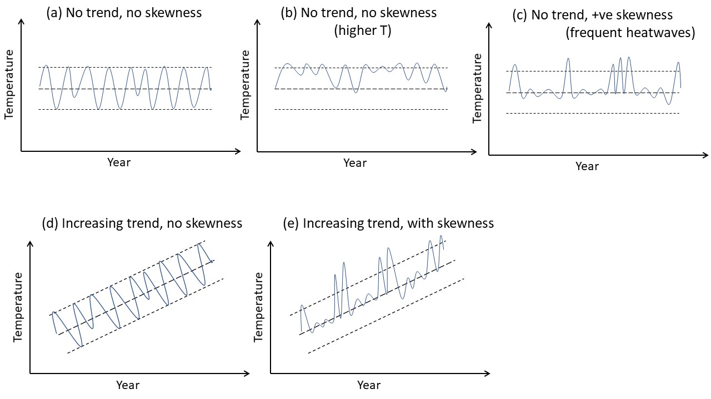

```{r include = FALSE, echo = FALSE}
knitr::opts_chunk$set(include = TRUE,
                      warning = FALSE,
                      message = FALSE,
                      cache = FALSE)
```

```{r echo = FALSE}
#rm(list = ls())
library(tidyverse)
library(patchwork)
library(here)
source(here("R", "mtime.R"))
```

# Introduction

*The following text originally came from the Ghosh UZH UFO application*

As the global climate is experiencing more heat, and less rainfall - it is reasonable to expect that the distributions of these variables (temperature and rainfall) are becoming more skewed and asymmetric towards the extreme values (see figure \@ref(fig:introduction-figure) below, which comes from the UZH UFO proposal, where it was figure 2). With the availability of more open access long-term databases, it is possible to address how different taxa respond at the community level.

```{r introduction-figure, echo=FALSE, fig.cap="Introduction figure", out.width = '50%', fig.align='center'}
#here("Results/some_assets/Intro_figure.png")
knitr::include_graphics(here("Results/some_assets/Intro_figure.png"),
                        rel_path = FALSE)
```


As a preliminary work, I have already gathered long-term (median of 41 years) species-level abundance data for 2043 terrestrial and 716 aquatic communities. My recent result (manuscript in preparation) shows that the community stability is different for terrestrial and freshwater taxa and could be better explained considering the different strengths between pairwise species associations at the extremes, called community-level tail association, than with classic correlates of community stability studies (richness and variance ratio).

I will gather global data for annual temperature and rainfall from open access CHELSA database19 and ask how variability in temperature and precipitation would affect terrestrial taxa (birds, mammals, invertebrates, plants). For freshwater taxa (fish, phytoplankton, invertebrates), mostly temperature variability would be considered. In marine realm, sampling is spatially not consistent over the years20 and also very few long-term (>20yrs) data sampled compared to terrestrial and freshwater, thus I will focus only on the latter two realms. Also, species-level biomass (or body size) data will be gathered considering different generation times across taxa.

I will focus on community stability and will build a Bayesian model incorporating climatic factors (e.g., variability, skewness, range of maximum and minimum of temperature-distribution over the years etc.). While scientists studied thermophilization in the context of warming-related turnover in communities, no predictive model for community stability has been developed, to date, assessing the effect of extreme climatic events across taxa using a global database. This study will inform the current status of communities across multiple taxa facing climatic extremes and help prioritize conservation efforts (see Work Package 2).

I will gather annual climate data (mean, minimum, maximum for temperature, rainfall) and compute the variability, and the skewness of their distribution for the study period over which the community dynamics was studied. I will compute the richness (number of total species and dominant species that were present minimum 70% of the total years sampled), variance ratio, community level total tail association from pairwise synchrony as drivers. These drivers appeared as significant for explaining variation in community stability from my recent study (manuscript in preparation). I will compute the response variable community stability as the inverse of community-variability over the study period. Then, I will build a Bayesian model to see the effect of climate parameters, on the stability-driver relationships for different taxa.

# Data

## Data structure
Total 1948 community timeseries we have collected for the timespan 1979-2019. 4 taxa are considered - birds, fish, freshwater invertebrates, terrestrial invertebrates. Below is the summary of the datatable. Description of each column is given in [README.txt](https://github.com/sghosh89/WP2/tree/main/Results)
```{r read_data_str, echo=F}
library(dplyr)
library(tidyverse)

sm_all<-read.csv(here("Results/stability_metric_and_env_all.csv"))
str(sm_all) # total communities within 1979-2019 timespan, we selected only 4 taxa
```

But see the below table which shows the sample size for each taxa and the datasource, we have very few sample size for terrestrial invertebrates. **I feel** it's better to write a paper about north american birds vs european fish (atleast we have >500 datapoints for birds and fish). But I am open to other ideas. I don't know which kind of data requirement we need for response diversity, but if we can have the body size or biomass (as trait) data then I can test the H0: whether response diversity increases the stability or influenced by temperature?
```{r read_data_str2, echo=F}
sm_all%>%group_by(TAXA,source)%>%summarise(n=n())%>%ungroup()
```

## Sitemap for each taxa

```{r sitemap_figure, echo=FALSE, out.width = '100%', fig.align='center'}
library(htmltools)
library(htmlwidgets)
library(leaflet)

taxalist<-c("birds","fish","freshwater invertebrates","terrestrial invertebrates")
sitemaplist<-vector(mode = "list", length = length(taxalist))
#op<-par(mfrow=c(2,2))
for(i in 1:length(taxalist)){
  taxa<-taxalist[i]
  dat<-sm_all%>%filter(TAXA==taxa) %>%
    dplyr::select(STUDY_ID,newsite,LATITUDE,LONGITUDE)

  sitemap<-leaflet(dat) %>% addTiles() %>%
    addMarkers(~LONGITUDE, ~LATITUDE, label = ~htmlEscape(newsite))%>%
    addControl(paste(taxa,", n = ",nrow(dat),sep=""), position = "bottomleft", className="map-title")
  sitemaplist[[i]]<-sitemap
  f<-here(paste("Results/res_Prelim_Report/samplingsite_",taxa,
           ".html",sep=""))
  htmlwidgets::saveWidget(sitemap,
                          file.path(normalizePath(dirname(f)),basename(f)))
}
#par(op)
#htmltools::includeHTML("../Results/res_Prelim_Report/samplingsite_birds.html")
sitemaplist[[1]]
sitemaplist[[2]]
sitemaplist[[3]]
sitemaplist[[4]]
```

# Methods

# Results

I want to see how community stability-drivers relationship would affect by the changing environmental variable (annual temperature distribution). Temperature could vary in many ways (see \@ref(fig:drawing-figure)). I am considering three aspects of environmental (temperature) timeseries here: median of annual temperatures ($t_{med}$) during the study periods, trend ($t_{trend}$) and skewness ($t_{skw}$) of annual temperature timeseries for a given community.
My intuition is:

  - community stability would be affected by any of these temperature component either directly or indirectly via the drivers.
  - As $t_{med}$, $t_{trend}$ changes, diversity-stability relationship should be affected, so stability would change via portfolio effect. e.g. terrestrial plants, beetles, and vertebrates show declining richness with incresing temperature in the past studies.
  - Similarly, changing $t_{med}$, $t_{trend}$ should relate how species interactions get modified in a changing environment. For example, as temperature increases (or decreases) $t_{med}$, community might loose some species, and might be dominated by fewer species which may or may not be synchronous, depending on the species-traits at that particular environment. But if $t_{trend}$ increases, the community is exposing to warmer environment with years, then maybe warm adapted species will become dominant and species with similar traits can have higher synchrony. I am not sure, what will happen - but we can see how community-level response (avg of all species'response to warming in that community) changes with temperature?
  - Changing $t_{skw}$, means frequent extreme events (like heatwaves, negative skewed annual temperature distribution), and it should be related to tail-dependent synchrony, where pairwise synchrony between species gets stronger beyond a certain threshold.

```{r drawing-figure, echo=FALSE, fig.cap="Temperature timeseries figure", out.width = '50%', fig.align='center'}
#
knitr::include_graphics(here("Results/some_assets/drawing.jpg"),
                        rel_path = FALSE)# CHEK LATER TO HOW USE HERE
```

But before go into modeling I just want to visualize the raw data below for birds and fish (top two largest taxa):
```{r exploratory-plots, echo=F, out.width = '75%',fig.cap=c("Stability-diversity relationship for birds and fish", "Stability-diversity relationship for birds at different temperature levels", "Stability-synchrony relationship for birds at different temperature levels", "Birds: no change in synchrony level with increasing temperature","Stability-diversity relationship for fish at different temperature levels","Stability-synchrony relationship for fish at different temperature levels", "Fish: asynchrony increases with increasing temperature","Density plot of all sites with skewed temperature timeseries","Density plot of all sites with skewed temperature timeseries: for birds and fish","Stability-temperature plot at different richness levels")}
library(dplyr)
library(tidyverse)
#------ get stability vs richness rawdata plot for each taxa first -----
sm_all%>%filter(TAXA%in%c("birds","fish"))%>%ggplot(aes(x=nsp,y=iCValt))+geom_point(alpha=0.3)+geom_smooth(method="lm")+
  scale_x_continuous(trans = 'log2') +
  scale_y_continuous(trans = 'log2')+xlab("Richness")+ylab("Community stability")+
  facet_wrap(~TAXA)+theme_bw()


#----- plots for birds -----
taxa<-"birds"
q_T_taxa<-sm_all%>%filter(TAXA==taxa)%>%summarise(q=quantile(t_med,c(0.25,0.75)))

lowT_taxa<-sm_all%>%filter(TAXA==taxa)%>%filter(t_med<=unname(q_T_taxa[1,1]))
highT_taxa<-sm_all%>%filter(TAXA==taxa)%>%filter(t_med>=unname(q_T_taxa[2,1]))

sb<-sm_all%>%filter(TAXA==taxa)

ggplot()+
  geom_point(data=sb,aes(x=nsp,y=iCValt),alpha=0.2)+
  geom_point(data=lowT_taxa,aes(x=nsp,y=iCValt),alpha=0.3,color="blue")+
  geom_point(data=highT_taxa,aes(x=nsp,y=iCValt),alpha=0.3,color="red")+
  geom_smooth(data=sb,aes(x=nsp,y=iCValt, colour="black"),method="lm", se=T) +
  geom_smooth(data=lowT_taxa,aes(x=nsp,y=iCValt, colour="blue"),method="lm", se=T)+
  geom_smooth(data=highT_taxa,aes(x=nsp,y=iCValt, colour="red"),method="lm", se=T)+
  scale_x_continuous(trans = 'log2') +
  scale_y_continuous(trans = 'log2')+
  ylab("Stability, log2 scale")+xlab("Richness, log2 scale")+
  scale_color_identity(name = "", guide="legend",
                       labels = c("all data", "low T, <50%CI", "high T, >50%CI"))+
  ggtitle(taxa)+theme_bw()

ggplot()+
  geom_point(data=sb,aes(x=phi_LdM,y=iCValt),alpha=0.2)+
  geom_point(data=lowT_taxa,aes(x=phi_LdM,y=iCValt),alpha=0.3,color="blue")+
  geom_point(data=highT_taxa,aes(x=phi_LdM,y=iCValt),alpha=0.3,color="red")+
  geom_smooth(data=sb,aes(x=phi_LdM,y=iCValt, colour="black"),method="lm", se=T) +
  geom_smooth(data=lowT_taxa,aes(x=phi_LdM,y=iCValt, colour="blue"),method="lm", se=T)+
  geom_smooth(data=highT_taxa,aes(x=phi_LdM,y=iCValt, colour="red"),method="lm", se=T)+
  scale_x_continuous(trans = 'log2') +
  scale_y_continuous(trans = 'log2')+
  ylab("Stability, log2 scale")+xlab("Synchrony, VR_LdM, log2 scale")+
  scale_color_identity(name = "", guide="legend",
                       labels = c("all data", "low T, <50%CI", "high T, >50%CI"))+
  ggtitle(taxa)+theme_bw()

#----- do a boxplot for VR at low/high temp, birds -----
lowT_taxa$label<-"low T"
highT_taxa$label<-"high T"
compare_T<-rbind(lowT_taxa,highT_taxa)
ggplot(data = compare_T, aes(x=label, y=phi_LdM)) +
  geom_boxplot(aes(fill=label))+ggtitle(taxa)+xlab("Temperature beyond 50% CI")+ylab("Synchrony")+theme_bw()

#----- plots for fish -----
taxa<-"fish"
q_T_taxa<-sm_all%>%filter(TAXA==taxa)%>%summarise(q=quantile(t_med,c(0.25,0.75)))

lowT_taxa<-sm_all%>%filter(TAXA==taxa)%>%filter(t_med<=unname(q_T_taxa[1,1]))
highT_taxa<-sm_all%>%filter(TAXA==taxa)%>%filter(t_med>=unname(q_T_taxa[2,1]))

sb<-sm_all%>%filter(TAXA==taxa)

ggplot()+
  geom_point(data=sb,aes(x=nsp,y=iCValt),alpha=0.2)+
  geom_point(data=lowT_taxa,aes(x=nsp,y=iCValt),alpha=0.3,color="blue")+
  geom_point(data=highT_taxa,aes(x=nsp,y=iCValt),alpha=0.3,color="red")+
  geom_smooth(data=sb,aes(x=nsp,y=iCValt, colour="black"),method="lm", se=T) +
  geom_smooth(data=lowT_taxa,aes(x=nsp,y=iCValt, colour="blue"),method="lm", se=T)+
  geom_smooth(data=highT_taxa,aes(x=nsp,y=iCValt, colour="red"),method="lm", se=T)+
  scale_x_continuous(trans = 'log2') +
  scale_y_continuous(trans = 'log2')+
  ylab("Stability, log2 scale")+xlab("Richness, log2 scale")+
  scale_color_identity(name = "", guide="legend",
                       labels = c("all data", "low T, <50%CI", "high T, >50%CI"))+
  ggtitle(taxa)+theme_bw()

ggplot()+
  geom_point(data=sb,aes(x=phi_LdM,y=iCValt),alpha=0.2)+
  geom_point(data=lowT_taxa,aes(x=phi_LdM,y=iCValt),alpha=0.3,color="blue")+
  geom_point(data=highT_taxa,aes(x=phi_LdM,y=iCValt),alpha=0.3,color="red")+
  geom_smooth(data=sb,aes(x=phi_LdM,y=iCValt, colour="black"),method="lm", se=T) +
  geom_smooth(data=lowT_taxa,aes(x=phi_LdM,y=iCValt, colour="blue"),method="lm", se=T)+
  geom_smooth(data=highT_taxa,aes(x=phi_LdM,y=iCValt, colour="red"),method="lm", se=T)+
  scale_x_continuous(trans = 'log2') +
  scale_y_continuous(trans = 'log2')+
  ylab("Stability, log2 scale")+xlab("Synchrony, VR_LdM, log2 scale")+
  scale_color_identity(name = "", guide="legend",
                       labels = c("all data", "low T, <50%CI", "high T, >50%CI"))+
  ggtitle(taxa)+theme_bw()

#----- do a boxplot for VR at low/high temp, fish -----
lowT_taxa$label<-"low T"
highT_taxa$label<-"high T"
compare_T<-rbind(lowT_taxa,highT_taxa)
ggplot(data = compare_T, aes(x=label, y=phi_LdM)) +
  geom_boxplot(aes(fill=label))+ggtitle(taxa)+xlab("Temperature beyond 50% CI")+ylab("Synchrony")+theme_bw()

#----- skewness plot across taxa, fish gets more extremes but as taildep synchrony is not important driver for freshwater systems stability is directly affected by skewness there ----
sm_all_bf<-sm_all%>%filter(TAXA%in%c("birds","fish"))
br <- c(min(sm_all_bf$t_skw),0,max(sm_all_bf$t_skw))
sm_all_bf%>%
  ggplot( aes(x=t_skw, stat(density))) +
  ggtitle("birds and fish")+
  geom_text(
    aes(label = round(stat(count) / sum((count)), 3)),
    stat = 'bin', vjust = -0.5, breaks = br
  )+ ylim(c(0, 1))+geom_density()+
  annotate("rect", xmin=min(sm_all_bf$t_skw), xmax=0, ymin=0, ymax=1, alpha=0.15, fill="red")+
  annotate("rect", xmin=0, xmax=max(sm_all_bf$t_skw), ymin=0, ymax=1, alpha=0.15, fill="blue")+
  theme_classic()

sm_all_bf%>%
  ggplot( aes(x=t_skw,y=..scaled..))+geom_density()+ylim(c(0, 1))+
  annotate("rect", xmin=min(sm_all_bf$t_skw), xmax=0, ymin=0, ymax=1, alpha=0.15, fill="red")+
  annotate("rect", xmin=0, xmax=max(sm_all_bf$t_skw), ymin=0, ymax=1, alpha=0.15, fill="blue")+
  theme_classic()+facet_wrap(~TAXA)

#----- stability vs. temperature plot for varying richness as Owen suggested, though I'm not sure does he mean as I show here ----
sm_all_bf$richness_level2<-cut(sm_all_bf$nsp,
                              breaks = c(1,10,20,30,40,50,60,70,80,90),
                              labels=c("2-10","11-20","21-30","31-40","41-50",
                                       "51-60", "61-70","71-80","81-88"))
sm_all_bf$richness_level<-cut(sm_all_bf$nsp,
                              breaks = c(1,20,40,60,80,100),
                              labels=c("1-20","21-40","41-60",
                                       "61-80","81-100"))

ggplot(data=sm_all_bf,
               aes(x=t_med, y=iCValt, col=richness_level))+
  geom_point(alpha=0.2) +
  geom_smooth(method = "lm") +
  facet_wrap(~TAXA)+
  theme_bw()+
  xlab("t_med (K/10 unit)")+
  ylab("Stability")
```

So, from the exploratory plots we can see: at higher temperature positive stability-diversity relationship becomes stronger for birds but for fish it becomes week. Also fish becomes more asynchronous with increasing temperature. So, why does that happen? to find this we could explore how much the bird species and fish species are consistent to temperature change across all communities.


**The cue is:** if fish species are not much consistent in their response to warming and vary across sites, that means you cannot make a conclusion that they would become similar with changing temperature. On another note, bird species should be more consistent towards warming if their is no change in their synchrony level across communities. Another possibility could be with changing temperature you might loose some species (its not just number of individuals, it will selectively prefer few species with better fitness), and then the communities will be dominated by few species with similar traits (so increasing synchrony). we will test this below.

```{r check_consistency, echo=F, cache=T, message=F, cache.extra=list(mtime(here("Results/stability_metric_and_env_all.csv")), mtime(here("Results/birds_splist_consistency_table.csv")),mtime(here("Results/fish_splist_consistency_table.csv")),mtime(here("Results/birds_splist_with_temp_sensitivity.csv")),mtime(here("Results/fish_splist_with_temp_sensitivity.csv")))}

sm_all<-read.csv(here("Results/stability_metric_and_env_all.csv"))

#-------- plot for birds ----------------------------------------
taxa<-"birds"
cons_tab_all<-read.csv(here("Results/birds_splist_consistency_table.csv"))
df<-read.csv(here("Results/birds_splist_with_temp_sensitivity.csv"))

rg<-range(cons_tab_all$avgcorval)
rg1<-floor(rg[1])
rg2<-ceiling(rg[2])

hist(cons_tab_all$avgcorval,50,col="green",border=F,
     xlab="avg correlation across occurence sites",xlim=c(-1,1),
     main=paste("birds, ",nrow(cons_tab_all)," unique species across ",length(unique(df$newsite))," sites",sep=""))
abline(v=0,col="black",lty=2)
text(x=0.5, y=25, paste(round(100*sum(cons_tab_all$avgcorval>0)/nrow(cons_tab_all),2),"%"),
     col = "red", srt = 0)
text(x=-0.5, y=25, paste(round(100*sum(cons_tab_all$avgcorval<0)/nrow(cons_tab_all),2),"%"),
     col = "blue", srt = 0)

# now, make histogram for those species which occur in lowT_taxa
q_T_taxa<-sm_all%>%filter(TAXA==taxa)%>%summarise(q=quantile(t_med,c(0.25,0.75)))

lowT_taxa<-sm_all%>%filter(TAXA==taxa)%>%filter(t_med<=unname(q_T_taxa[1,1]))
highT_taxa<-sm_all%>%filter(TAXA==taxa)%>%filter(t_med>=unname(q_T_taxa[2,1]))

df_lowT_taxa<-df%>%filter(newsite%in%lowT_taxa$newsite)
df_highT_taxa<-df%>%filter(newsite%in%highT_taxa$newsite)

# first with lowT 
cons_tab_lowT_taxa<-df_lowT_taxa%>%group_by(spname)%>%
  summarise(poscorsite=sum(spearcor_with_t>0),
            negcorsite=sum(spearcor_with_t<0),
            zerocorsite=sum(spearcor_with_t==0),
            poscorval=sum(spearcor_with_t[which(spearcor_with_t>0)]),
            negcorval=sum(spearcor_with_t[which(spearcor_with_t<0)]),
            zerocorval=sum(spearcor_with_t[which(spearcor_with_t==0)]))%>%ungroup()%>%
  group_by(spname)%>%mutate(occur_sites=sum(poscorsite,negcorsite,zerocorsite))%>%
  mutate(avgcorval=sum(poscorval,negcorval,zerocorval)/occur_sites)%>%ungroup()

hist(cons_tab_lowT_taxa$avgcorval,50,col="green",border=F,
     xlab="overall correlation across cold occurence sites",xlim=c(-1,1),
     main=paste("birds, ",nrow(cons_tab_lowT_taxa)," unique species across ",length(unique(df_lowT_taxa$newsite))," sites",sep=""))
abline(v=0,col="black",lty=2)
text(x=0.5, y=25, paste(round(100*sum(cons_tab_lowT_taxa$avgcorval>0)/nrow(cons_tab_lowT_taxa),2),"%"),
     col = "red", srt = 0)
text(x=-0.5, y=25, paste(round(100*sum(cons_tab_lowT_taxa$avgcorval<0)/nrow(cons_tab_lowT_taxa),2),"%"),
     col = "blue", srt = 0)

#sum(cons_tab_lowT_taxa$diffcor==0)
# 8 sp. show positive response to warming, 2 was independent

# then with highT 
cons_tab_highT_taxa<-df_highT_taxa%>%group_by(spname)%>%
  summarise(poscorsite=sum(spearcor_with_t>0),
            negcorsite=sum(spearcor_with_t<0),
            zerocorsite=sum(spearcor_with_t==0),
            poscorval=sum(spearcor_with_t[which(spearcor_with_t>0)]),
            negcorval=sum(spearcor_with_t[which(spearcor_with_t<0)]),
            zerocorval=sum(spearcor_with_t[which(spearcor_with_t==0)]))%>%ungroup()%>%
  group_by(spname)%>%mutate(occur_sites=sum(poscorsite,negcorsite,zerocorsite))%>%
  mutate(avgcorval=sum(poscorval,negcorval,zerocorval)/occur_sites)%>%ungroup()

hist(cons_tab_highT_taxa$avgcorval,50,col="green",border=F,
     xlab="overall correlation across hot occurence sites",xlim=c(-1,1),
     main=paste("birds, ",nrow(cons_tab_highT_taxa)," unique species across ",length(unique(df_highT_taxa$newsite))," sites",sep=""))
abline(v=0,col="black",lty=2)
text(x=0.5, y=25, paste(round(100*sum(cons_tab_highT_taxa$avgcorval>0)/nrow(cons_tab_highT_taxa),2),"%"),
     col = "red", srt = 0)
text(x=-0.5, y=25, paste(round(100*sum(cons_tab_highT_taxa$avgcorval<0)/nrow(cons_tab_highT_taxa),2),"%"),
     col = "blue", srt = 0)

#-------- plot for fish ------------------------------------
taxa="fish"
cons_tab_all<-read.csv(here("Results/birds_splist_consistency_table.csv"))
df<-read.csv(here("Results/fish_splist_with_temp_sensitivity.csv"))

hist(cons_tab_all$avgcorval,50,col="skyblue",border=F,
     xlab="overall correlation across occurence sites",xlim=c(-1,1),
     main=paste("fish, ",nrow(cons_tab_all)," unique species across ",length(unique(df$newsite))," sites",sep=""))
abline(v=0,col="black",lty=2)
text(x=0.5, y=8, paste(round(100*sum(cons_tab_all$avgcorval>0)/nrow(cons_tab_all),2),"%"),
     col = "red", srt = 0)
text(x=-0.5, y=8, paste(round(100*sum(cons_tab_all$avgcorval<0)/nrow(cons_tab_all),2),"%"),
     col = "blue", srt = 0)

# now, make histogram for those species which occur in lowT_taxa
q_T_taxa<-sm_all%>%filter(TAXA==taxa)%>%summarise(q=quantile(t_med,c(0.25,0.75)))
#q_T_taxa<-sm_all%>%filter(TAXA==taxa)%>%summarise(q=quantile(t_med,c(0.35,0.65)))

lowT_taxa<-sm_all%>%filter(TAXA==taxa)%>%filter(t_med<=unname(q_T_taxa[1,1]))
highT_taxa<-sm_all%>%filter(TAXA==taxa)%>%filter(t_med>=unname(q_T_taxa[2,1]))

df_lowT_taxa<-df%>%filter(newsite%in%lowT_taxa$newsite)
df_highT_taxa<-df%>%filter(newsite%in%highT_taxa$newsite)

# first with lowT 
cons_tab_lowT_taxa<-df_lowT_taxa%>%group_by(spname)%>%
  summarise(poscorsite=sum(spearcor_with_t>0),
            negcorsite=sum(spearcor_with_t<0),
            zerocorsite=sum(spearcor_with_t==0),
            poscorval=sum(spearcor_with_t[which(spearcor_with_t>0)]),
            negcorval=sum(spearcor_with_t[which(spearcor_with_t<0)]),
            zerocorval=sum(spearcor_with_t[which(spearcor_with_t==0)]))%>%ungroup()%>%
  group_by(spname)%>%mutate(occur_sites=sum(poscorsite,negcorsite,zerocorsite))%>%
  mutate(avgcorval=sum(poscorval,negcorval,zerocorval)/occur_sites)%>%ungroup()

hist(cons_tab_lowT_taxa$avgcorval,10,col="skyblue",border=F,
     xlab="overall correlation across cold occurence sites",xlim=c(-1,1),
     main=paste("fish, ",nrow(cons_tab_lowT_taxa)," unique species across ",length(unique(df_lowT_taxa$newsite))," sites",sep=""))
abline(v=0,col="black",lty=2)
text(x=0.5, y=1, paste(round(100*sum(cons_tab_lowT_taxa$avgcorval>0)/nrow(cons_tab_lowT_taxa),2),"%"),
     col = "red", srt = 0)
text(x=-0.5, y=1, paste(round(100*sum(cons_tab_lowT_taxa$avgcorval<0)/nrow(cons_tab_lowT_taxa),2),"%"),
     col = "blue", srt = 0)

#sum(cons_tab_lowT_taxa$diffcor==0)
# 8 sp. show positive response to warming, 2 was independent

# then with highT 
cons_tab_highT_taxa<-df_highT_taxa%>%group_by(spname)%>%
  summarise(poscorsite=sum(spearcor_with_t>0),
            negcorsite=sum(spearcor_with_t<0),
            zerocorsite=sum(spearcor_with_t==0),
            poscorval=sum(spearcor_with_t[which(spearcor_with_t>0)]),
            negcorval=sum(spearcor_with_t[which(spearcor_with_t<0)]),
            zerocorval=sum(spearcor_with_t[which(spearcor_with_t==0)]))%>%ungroup()%>%
  group_by(spname)%>%mutate(occur_sites=sum(poscorsite,negcorsite,zerocorsite))%>%
  mutate(avgcorval=sum(poscorval,negcorval,zerocorval)/occur_sites)%>%ungroup()

hist(cons_tab_highT_taxa$avgcorval,50,col="skyblue",border=F,
     xlab="overall correlation across hot occurence sites",xlim=c(-1,1),
     main=paste("fish, ",nrow(cons_tab_highT_taxa)," unique species across ",length(unique(df_highT_taxa$newsite))," sites",sep=""))
abline(v=0,col="black",lty=2)
text(x=0.5, y=6, paste(round(100*sum(cons_tab_highT_taxa$avgcorval>0)/nrow(cons_tab_highT_taxa),2),"%"),
     col = "red", srt = 0)
text(x=-0.5, y=6, paste(round(100*sum(cons_tab_highT_taxa$avgcorval<0)/nrow(cons_tab_highT_taxa),2),"%"),
     col = "blue", srt = 0)
```

```{r tmed_on_map, echo=F}
library(tidyverse)
library(leaflet)

plot_temp_on_map<-function(sm_all,t,taxa,scaleup){
  dat<-sm_all%>%filter(TAXA==taxa)%>%dplyr::select(STUDY_ID,newsite,nsp,LATITUDE,LONGITUDE,t_med,trend_t_tau,t_skw)

  # first cut the continuous variable into bins
  # these bins are now factors
  qt<-summary(dat[,t])
  qt<-unname(qt)
  qt<-qt[c(1,2,5,6)]

  dat$tmedLvl <- cut(dat[,t],
                     qt, include.lowest = T,
                     labels = c("<50%CI","50%CI",">50%CI"))

  # then assign a palette to this using colorFactor
  # in this case it goes from red for the smaller values to yellow and green
  # standard stoplight for bad, good, and best
  beatCol <- colorFactor(palette = c("blue","gray","red"), dat$tmedLvl)
  m1 <- leaflet() %>%
    addTiles() %>%
    addProviderTiles(providers$OpenStreetMap, group = 'Open SM')  %>%
    #setView(lng = -72, lat = 41, zoom = 8) %>%
    addCircleMarkers(data = dat, lat = ~LATITUDE, lng = ~LONGITUDE,
                     color = ~beatCol(tmedLvl), popup = dat$newsite,radius = ~sqrt(nsp*scaleup))%>%
    addLegend('bottomleft', pal = beatCol, values = dat$tmedLvl,
              title = paste(t,' for ',taxa),opacity = 0.5)
  m1
}

taxa<-"birds"
scaleup=1
plot_temp_on_map(sm_all,t="t_med",taxa,scaleup)

taxa<-"fish"
scaleup=3
plot_temp_on_map(sm_all,t="t_med",taxa,scaleup)
#plot_temp_on_map(sm_all,t="t_skw",taxa,scaleup)
```

From the above plots, we can see birds are showing consistent response-distribution across all temperature change, i.e., in either end of temperature spectrum (low or high end). That's why the synchrony level remains similar for birds.
But for fish, warming increases the richness (addition of new species), and as fish species now become more variable in response to temperature sensitivity (trait-variation), they show more asynchrony compared to low temperature scenario where only few species exists (see smaller circle size on the map for lowT,<50%CI) and show similar traits (so more synchrony).
**Note:** when I show this to Frank, he commented on how much robust is the pattern for fish at low T as there are only few species existed across 145 sites - so it also depends on how we considered the lowT-highT communities. I set beyond 50% CI of temperature range as low/high. Even if I decrease that to 30% CI, still very few species found in low T sites (15 sp across 203 sites: 80% >0, 20% <0 line).  

To further explore this idea: we collected traits data for birds and fish species used in the analysis. For fish-traits, I will use body length measurements, for bird-traits I will use HWI (Hand-wing index).
From below figures: at high T, birds have slightly less dispersal ability (lower HWI), but richness is more or less uniformly spread at either temperature range. For fish, at lowT, few large species exists with similar traits (remember the previous histogram plot 90-10) showing higher synchrony, as temperature increases addition of new small fishes in the community (maybe better environment for them to exist in that temperature rather than too cold water) makes them asynchronous with more trait variation (histogram plot 66-34).    

```{r plot_direct_traits, echo=F}
#---- plotting richness and traits for birds ----
# these are direct traits: body size
source(here("R/plot_birdtraits.R"))
source(here("R/plot_fishtraits.R"))
```

When I showed this to Blake, he was not convinced by the idea to split the data into two: low/high based on t_med (to him this temperature difference is more on latitudinal differences as shown in the map), and same species can exist in both communities - so why changing t_med should change the synchrony level for fish? and getting different bodysize fish from low/high t_med (fewer big fish in lowT and many smaller fish in highT) is not explaining why big fish should be more synchronous - is it because of fewer species (richness) or because bigger fish abundance change needs more time - not on annual scale?

So, I thought to make a plot of how community-level average response traits (average of standardised correlation between species abundance with t_med timeseries across sites) changes with increasing temperature (t_med)? For fish, it should decrease with increasing t_med, whereas for birds it should be a flat relationship.

```{r plot_tempcor_traits, echo=F}
# first for fish
library(tidyverse)
library(dplyr)
sm_all<-read.csv(here("Results/stability_metric_and_env_all.csv"))
#range(sm_all$t_med)

#---- for fish -----
taxa<-"fish"
sfi<-sm_all%>%filter(TAXA==taxa)

# all cor with temperature

df<-read.csv(here("Results/fish_splist_with_temp_sensitivity.csv"))

# consistency table

dfc<-read.csv(here("Results/fish_splist_consistency_table.csv"))

# first extract temperature-cor traits per community
df<-df%>%dplyr::select(spearcor_with_t,STUDY_ID,newsite,spname)
df2<-left_join(df,dfc,by="spname")
df2<-df2%>%dplyr::select(spearcor_with_t,STUDY_ID,newsite,spname,avgcorval)

df3<-df2%>%group_by(STUDY_ID,newsite)%>%summarise(avgcortraitval=mean(avgcorval))%>%ungroup()

mydat<-left_join(sfi,df3,by=c("STUDY_ID","newsite"))

# response traits vs. t_med plot
g1<-ggplot(mydat,aes(x=t_med,y=avgcortraitval))+geom_point(alpha=0.2)+geom_smooth(method="loess",color="blue",fill="cornflowerblue")+
  geom_hline(yintercept=0,linetype='dashed')+xlab("t_med, K/10 unit")+ylab("community-wide correlation traits, fish")+xlim(2600,3000)+theme_bw()
print(g1)
# richness vs. t_med plot
ggplot(mydat,aes(x=t_med,y=nsp))+geom_point(alpha=0.2)+geom_smooth(method="loess",color="blue",fill="cornflowerblue")+xlab("t_med, K/10 unit")+ylab("Richness, fish")+
  theme_bw()

#---- for birds -----
taxa<-"birds"
sfi<-sm_all%>%filter(TAXA==taxa)

# all cor with temperature
df<-read.csv(here("Results/birds_splist_with_temp_sensitivity.csv"))

# consistency table
dfc<-read.csv(here("Results/birds_splist_consistency_table.csv"))

# first extract temperature-cor traits per community
df<-df%>%dplyr::select(spearcor_with_t,STUDY_ID,newsite,spname)
df2<-left_join(df,dfc,by="spname")
df2<-df2%>%dplyr::select(spearcor_with_t,STUDY_ID,newsite,spname,avgcorval)

df3<-df2%>%group_by(STUDY_ID,newsite)%>%summarise(avgcortraitval=mean(avgcorval))%>%ungroup()

mydat<-left_join(sfi,df3,by=c("STUDY_ID","newsite"))

# response traits vs. t_med plot
g1<-ggplot(mydat,aes(x=t_med,y=avgcortraitval))+geom_point(alpha=0.2)+geom_smooth(method="loess",color="green",fill="darkolivegreen1")+
  geom_hline(yintercept=0,linetype='dashed')+xlab("t_med, K/10 unit")+ylab("community-wide correlation traits, birds")+xlim(2600,3000)+theme_bw()
print(g1)
# richness vs. t_med plot
ggplot(mydat,aes(x=t_med,y=nsp))+geom_point(alpha=0.2)+geom_smooth(method="loess",color="green",fill="darkolivegreen1")+xlab("t_med, K/10 unit")+ylab("Richness, birds")+
  theme_bw()
```

Possible explanation:

```{r response-scematicfig, echo=FALSE, fig.cap="Response variation with temperature", out.width = '100%', fig.align='center'}
knitr::include_graphics(here("Results/some_assets/responsetraits.jpg"),
                        rel_path = FALSE)
```

Now, we will do a path analysis for a simplistic mixed effect model to see the environmental effects on community stability for both taxa.

```{r model_psem, echo=F, cache=T, message=F, cache.extra=list(mtime(here("Results/stability_metric_and_env_all.csv")), mtime(here("R/plot_psem.R")))}
library(tidyverse)
library(lme4)
library(piecewiseSEM)
source(here("R/plot_psem.R"))

sm_all<-read.csv(here("Results/stability_metric_and_env_all.csv"))
sm_all$UID<-paste(sm_all$source,sm_all$STUDY_ID,sep="_")
sm_all$A<-sm_all$L+abs(sm_all$U) # total asymmetry
sm_all<-sm_all%>%dplyr::rename(
  stability=iCValt,
  VR=phi_LdM,
  R=nsp)

sm_all$TAXA<-as.factor(sm_all$TAXA)
#sm_all%>%group_by(TAXA)%>%summarise(n=n())%>%ungroup()

############ want rescaling? #################
mydat_scaled<-sm_all
mydat_scaled$stability<-as.numeric(scale(mydat_scaled$stability))
mydat_scaled$R<-as.numeric(scale(mydat_scaled$R))
mydat_scaled$VR<- as.numeric(scale(mydat_scaled$VR))
mydat_scaled$A<- as.numeric(scale(mydat_scaled$A))

mydat_scaled$t_med<-as.numeric(scale(mydat_scaled$t_med))
mydat_scaled$tmax_med<-as.numeric(scale(mydat_scaled$tmax_med))
mydat_scaled$tmin_med<-as.numeric(scale(mydat_scaled$tmin_med))

mydat_scaled$t_skw<-as.numeric(scale(mydat_scaled$t_skw))
mydat_scaled$tmax_skw<-as.numeric(scale(mydat_scaled$tmax_skw))
mydat_scaled$tmin_skw<-as.numeric(scale(mydat_scaled$tmin_skw))
mydat_scaled$t_var<-as.numeric(scale(mydat_scaled$t_var))

#---  

resloc<-here("Results/res_Prelim_Report/")

#cat("=========================== taxa = birds =============================== \n")
taxa<-"birds"
dat<-mydat_scaled%>%filter(TAXA==taxa)
n<-nrow(dat)
model_psem<-piecewiseSEM::psem(
  lmer(VR ~ R+t_med+trend_t_tau+(1|UID),data=dat),
  lmer(A ~ R+t_skw+(1|UID),data=dat),
  lmer(R~t_med+trend_t_tau+(1|UID),data=dat),
  lmer(stability ~ (R + VR +A)+t_med+trend_t_tau+t_skw+
         (1|UID), data=dat))
cc<-coefs(model_psem)
plot_psem(n,taxa,cc,layout="circle")
#print(summary(model_psem))
saveRDS(model_psem,paste(resloc,"model_psem_",taxa,".RDS",sep=""))

#cat("=========================== taxa = fish =============================== \n")
taxa<-"fish"
dat<-mydat_scaled%>%filter(TAXA==taxa)
n<-nrow(dat)
model_psem<-piecewiseSEM::psem(
  lmer(VR ~ R+t_med+trend_t_tau+(1|UID),data=dat),
  lmer(A ~ R+t_skw+(1|UID),data=dat),
  lmer(R~t_med+trend_t_tau+(1|UID),data=dat),
  lmer(stability ~ (R + VR +A)+t_med+trend_t_tau+t_skw+
         (1|UID), data=dat))
cc<-coefs(model_psem)
plot_psem(n,taxa,cc,layout="circle")
#print(summary(model_psem))
saveRDS(model_psem,paste(resloc,"model_psem_",taxa,".RDS",sep=""))
```

So, from the path analysis, what do we see for birds -

- for birds: increasing temperature trend (communities exposed to continuous warming) decreases species richness, increasing synchrony. (because of similar species traits in warmer condition?)
- increasing extreme heatwaves (note this is negative skewness) will increase tail dep synchrony, which in turn decreases stability. Here direct effect of t_skw is not significant on stability, as all bird data have equal proportion of +ve and -ve skewness (see above plot). But still tail dependent synchrony is important mechanism for stability, especially for terrestrial taxa (we found this from BioDyn project), and driven by the skewness of temperature time series (extreme events).
- positive diversity-stability relationship and negative synchrony-stability relationship are observed as expected.

and for fish -

- overall synchrony (variance ratio) is the important determinant for stability (this we knew from BioDyn project findings), as it connects the environmental effects to stability.
- both warming scenario (median temperature or temperature trend) increases richness, increasing temperature increases more asynchrony (-ve effect on VR), which is also consistent with more variable traits for the fish species.
- increasing extremes makes community biomass more variable (-ve effect of heatwaves on stability via t_skw direct effect, not indirect effect through tail-dep synchrony as it is not important driver for freshwater as we found from BioDyn).

# Discussion
